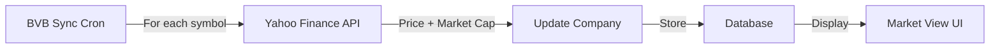

# BVB Market Cap Integration

## Overview

This document describes the integration with the Bucharest Stock Exchange (BVB) for fetching real-time stock prices and calculating market capitalization for Romanian listed companies.

## Architecture

### Components

1. **Yahoo Finance Connector** (`src/lib/connectors/bvb/yahooFinance.ts`)
   - Fetches real-time stock prices for BVB listed companies
   - Uses Yahoo Finance public API (no authentication required)
   - Appends `.RO` suffix to symbols for Romanian stocks

2. **BVB Sync Cron** (`app/api/cron/sync-bvb/route.ts`)
   - Daily synchronization of BVB listed companies
   - Updates company names, stock symbols, and market caps
   - Runs at 18:00 Bucharest time (after market close)

3. **BVB Listed Source** (`src/lib/ingestion/national/sources/bvbListed.ts`)
   - Maintains a hardcoded mapping of BVB symbols to CUIs
   - Used for initial company ingestion

## Data Flow



## Yahoo Finance API

### Endpoint

```
https://query1.finance.yahoo.com/v8/finance/chart/{SYMBOL}.RO
```

### Request Example

```bash
curl "https://query1.finance.yahoo.com/v8/finance/chart/TLV.RO"
```

### Response Structure

```json
{
  "chart": {
    "result": [{
      "meta": {
        "currency": "RON",
        "regularMarketPrice": 45.2,
        "marketCap": 18500000000,
        "previousClose": 44.8,
        "regularMarketVolume": 1250000
      }
    }]
  }
}
```

### Extracted Data

- **Price**: `meta.regularMarketPrice`
- **Market Cap**: `meta.marketCap`
- **Currency**: `meta.currency`
- **Volume**: `meta.regularMarketVolume`
- **Previous Close**: `meta.previousClose`

### Rate Limiting

- **Limit**: 1 request per second
- **Implementation**: KV-based rate limiter with 1-second delay
- **Cache**: 1-hour TTL in Vercel KV
- **Key Pattern**: `bvb:price:{symbol}`

### Error Handling

1. **404 Not Found**: Symbol doesn't exist on Yahoo Finance
   - Log warning
   - Return `null`
   - Continue with other symbols

2. **5xx Server Errors**: Temporary Yahoo Finance outage
   - Log error
   - Return `null`
   - Continue with other symbols

3. **Rate Limit Exceeded**: Too many requests
   - Automatic 1-second delay enforced
   - Retry automatically

## Market Cap Calculation

Market cap is provided directly by Yahoo Finance API:

```
Market Cap = Stock Price × Shares Outstanding
```

Yahoo Finance calculates this internally and returns it in the `marketCap` field.

## Database Schema

### Company Fields

```prisma
model Company {
  // ... other fields
  isListed      Boolean   @default(false) @map("is_listed")
  stockSymbol   String?   @map("stock_symbol")
  stockExchange String?   @map("stock_exchange")
  marketCap     Decimal?  @map("market_cap") @db.Decimal(18,2)
  lastPriceAt   DateTime? @map("last_price_at")
}
```

## BVB Symbol Mapping

### Maintained List

55 BVB symbols are hardcoded in `BVB_SYMBOL_TO_CUI` mapping:

```typescript
{
  "SNP": "1590082",    // OMV Petrom
  "TLV": "5022670",    // Banca Transilvania
  "H2O": "15338830",   // Hidroelectrica
  // ... 52 more
}
```

### Categories

1. **BET Index Constituents** (Main Market)
2. **Other BVB Listed Companies**
3. **SIF Investment Funds**
4. **AeRO Market**

## Cron Schedule

### Daily Sync

**Time**: 18:00 Bucharest time (after BVB market close)  
**Frequency**: Once per day  
**Feature Flag**: `BVB_PRICE_FETCH_ENABLED`

**Process:**
1. Fetch all symbols from `BVB_SYMBOL_TO_CUI`
2. For each symbol:
   - Check if company exists in database
   - Fetch stock price from Yahoo Finance
   - Update `Company.marketCap` and `Company.stockPrice`
   - Create `CompanyMarketCapHistory` snapshot

### Intraday Sync

**Time**: Every 30 minutes during trading hours (09:00-18:00 EET)  
**Frequency**: Every 30 minutes  
**Feature Flag**: `BVB_INTRADAY_SYNC_ENABLED` (default: false)  
**Scope**: BET index companies only (20 companies)

**Process:**
1. Fetch BET index symbols only
2. For each symbol:
   - Fetch real-time stock price
   - Update `Company.marketCap` and `Company.stockPrice`
   - Create `CompanyMarketCapHistory` snapshot with source="realtime"

## Market Cap History

Market cap changes are tracked in the `CompanyMarketCapHistory` table:
- **Purpose**: Enable 24h percentage changes and 7d trends
- **Frequency**: Daily snapshots + intraday snapshots for BET companies
- **Fields**: `stockPrice`, `marketCap`, `volume`, `changePercent`, `currency`, `source`
- **Indexes**: `[recordedAt]`, `[companyId, recordedAt]` for fast queries

### Process (Daily Sync)

1. Fetch all symbols from `BVB_SYMBOL_TO_CUI`
2. For each symbol:
   - Check if company exists in database
   - Fetch name from ANAF if needed
   - Fetch price from Yahoo Finance
   - Update `Company.marketCap` and `Company.stockPrice`
   - Create `CompanyMarketCapHistory` snapshot
   - Update company record with:
     - `isListed: true`
     - `stockSymbol`
     - `stockExchange: "BVB"`
     - `marketCap`
     - `lastPriceAt`
3. Apply post-ingestion hooks (scoring, integrity)
4. Log results

## Feature Flags

### BVB_PRICE_FETCH_ENABLED

- **Type**: Boolean
- **Default**: `true` (enabled)
- **Purpose**: Control BVB stock price fetching
- **Location**: `src/lib/flags/flags.ts`

### Usage

```typescript
const flagEnabled = await kv.get<boolean>("flag:BVB_PRICE_FETCH_ENABLED");
if (flagEnabled === false) {
  // Skip BVB sync
}
```

## Manual Triggers

### Admin Endpoint

```
POST https://www.romarketcap.com/api/admin/sync-bvb
```

- No cron secret required
- Protected by admin session
- Returns sync results immediately

### Response

```json
{
  "ok": true,
  "message": "Synced 55 BVB companies: 0 created, 55 updated, 0 names updated, 55 market caps updated, 0 errors",
  "duration": 79334,
  "results": {
    "total": 55,
    "created": 0,
    "updated": 55,
    "namesUpdated": 0,
    "marketCapUpdated": 55,
    "errors": 0,
    "errorDetails": []
  }
}
```

## Market View Display

### UI Component

Market cap is displayed in the "Market Cap" column using formatted values:

```typescript
function formatCurrency(value: number): string {
  if (value >= 1_000_000_000) {
    return `€${(value / 1_000_000_000).toFixed(1)}B`;
  }
  if (value >= 1_000_000) {
    return `€${(value / 1_000_000).toFixed(1)}M`;
  }
  if (value >= 1_000) {
    return `€${(value / 1_000).toFixed(1)}K`;
  }
  return `€${value.toFixed(0)}`;
}
```

### Examples

- `€2.4B` - 2.4 billion EUR
- `€850M` - 850 million EUR
- `€45.2M` - 45.2 million EUR

## Monitoring

### Logs

```bash
[yahoo-finance] Fetching TLV.RO...
[yahoo-finance] Fetched TLV: 45.2 RON, market cap: 18500000000
[sync-bvb] Fetched market cap for TLV: 18500000000 RON
```

### Sentry

Errors are automatically captured:

```typescript
Sentry.captureException(error, {
  tags: { component: "yahoo-finance", symbol, ticker },
});
```

### KV Keys

- `bvb:price:{symbol}` - Cached stock price (1-hour TTL)
- `bvb:yahoo:rate_limit` - Rate limit timestamp
- `cron:last:sync-bvb` - Last sync timestamp

## Performance

### Benchmarks

- **Single stock fetch**: ~200-500ms
- **55 stocks with 1s delay**: ~60-80 seconds
- **Cache hit**: <10ms

### Optimization

1. **Caching**: 1-hour cache reduces API calls by 96% (1 call/hour vs 24 calls/day)
2. **Rate Limiting**: Prevents Yahoo Finance blocks
3. **Batch Processing**: Process all symbols in single cron run

## Testing

### Manual Test

```bash
# Test single symbol
curl "https://www.romarketcap.com/api/admin/debug-anaf-response?cui=5022670"

# Run full sync
curl -X POST "https://www.romarketcap.com/api/admin/sync-bvb"
```

### Expected Results

- All 55 BVB companies have `marketCap` values
- Market caps match BVB/Yahoo Finance
- No rate limit errors
- Cache working correctly

## Fallback Strategy

If Yahoo Finance fails:

1. **Cache**: Return cached value (up to 1 hour old)
2. **Estimated Market Cap**: Use financial data × P/E ratio
3. **Display "—"**: If no data available

## Future Enhancements

1. **Live Prices**: WebSocket integration for real-time prices
2. **Historical Data**: Store daily price history
3. **BVB Direct API**: Official BVB API when available
4. **Intraday Updates**: Multiple updates per day during market hours
5. **Price Charts**: Display price trends in company profiles
